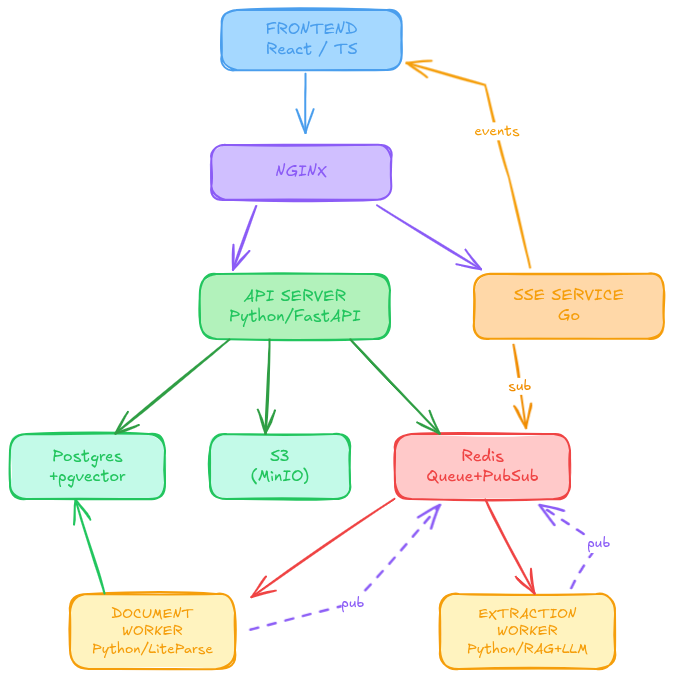

# Architecture — June Review Table

*Last updated: 2025-07-01 · Status: Active*

---

## System Architecture



**API Server** — Single FastAPI application. All CRUD for tables, columns, cells, documents. Generates presigned S3 URLs. Enqueues tasks to Redis. Serves the frontend's every need. Stateless.

**SSE Service** — Go. Holds long-lived SSE connections with frontends. Subscribes to Redis pub/sub. When a worker publishes an event, SSE Service pushes it to every connected client viewing that table. ~200 lines of Go. One goroutine per connection at 2KB each.

**Document Worker** — Python. Consumes `document_parsing` queue. Downloads PDF from S3, parses with LiteParse (local OCR + layout extraction with bounding boxes), chunks text, generates embeddings via external API, stores chunks in pgvector, publishes `doc_ready` event. CPU-bound. Low concurrency per instance (1-2 docs at a time). Scale horizontally.

**Extraction Worker** — Python. Consumes `extraction_tasks` queue. For each cell: retrieves relevant chunks from pgvector (RAG), constructs prompt, calls LLM, parses structured response (answer + reasoning + source references), saves cell result, publishes `cell_completed` event. IO-bound (waiting on LLM). High concurrency per instance (20-50 concurrent calls). Scale horizontally.

---

## Service Communication

| From | To | Via | Purpose |
|------|----|-----|---------|
| Frontend | API Server | HTTP | All CRUD, trigger runs, presigned URLs |
| Frontend | SSE Service | SSE | Receive real-time events (doc ready, cell completed) |
| API Server | Redis | LPUSH | Enqueue parsing and extraction tasks |
| API Server | S3 | AWS SDK | Generate presigned URLs |
| API Server | PostgreSQL | SQLAlchemy | Read/write all relational + vector data |
| Document Worker | Redis | BRPOP | Consume parsing tasks |
| Document Worker | S3 | HTTP | Download PDF files |
| Document Worker | API Server | HTTP | Store chunks, update doc status |
| Document Worker | Redis | PUBLISH | Emit doc_ready / doc_error events |
| Document Worker | Embedding API | HTTP | Generate vector embeddings |
| Extraction Worker | Redis | BRPOP | Consume extraction tasks |
| Extraction Worker | API Server | HTTP | Read chunks (RAG), save cell results |
| Extraction Worker | Redis | PUBLISH | Emit cell_completed / cell_error events |
| Extraction Worker | LLM API | HTTP | Generate cell answers |
| SSE Service | Redis | SUBSCRIBE | Listen for events from both workers |

---

## Data Flows

### Document Upload + Processing

```
1. Frontend selects files, requests presigned URL per file:
   POST /api/documents/upload-url → { doc_id, upload_url }

2. Frontend uploads directly to S3 via presigned URL (API Server never touches bytes)

3. Frontend confirms upload:
   POST /api/documents/{doc_id}/confirm
   → API Server creates DB record (status: "not_ready"), enqueues parsing task

4. Row appears in table immediately — faded with subtle pulse

5. Document Worker picks up task from Redis queue:
   Download from S3 → LiteParse (parse + OCR) → chunk text with bounding boxes
   → embed chunks → POST /api/documents/{doc_id}/chunks → PATCH status to "ready"
   → PUBLISH doc_ready event

6. SSE Service pushes event to frontend → row transitions from faded to solid
```

### Cell Extraction

```
1. User clicks Run:
   POST /api/tables/{id}/run
   → API Server finds all empty/stale cells, sets them to "extracting"
   → API Server enqueues ONE task per table run to Redis

2. Target cells show skeleton shimmer animation (triggered by immediate response)

3. Extraction Worker picks up table task:
   → GET /api/tables/{id}/extraction-manifest → list of all cells to process
   → For each unique document: fetch common chunks? (optional optimization)
   → For each cell concurrently:
     → GET /api/documents/{doc_id}/chunks?query={prompt} (RAG)
     → call LLM → parse response
     → PUBLISH cell_completed event (SSE Service)
   → Once finished or batch threshold reached:
     → POST /api/tables/{id}/cells/bulk-update

4. SSE Service pushes events → frontend updates cells individually: shimmer → answer text

5. Final run_completed event informs frontend that the entire run is finished.
```

### Source Verification

```
1. User clicks cell → Memory Drawer opens (reads from client-side state, zero API calls)
   Shows answer + reasoning + source chips for every column of that document

2. User clicks source chip (📎 p.14, §8.2):
   → GET /api/documents/{doc_id}/file → presigned S3 download URL
   → Frontend loads PDF, navigates to page 14
   → GET /api/documents/{doc_id}/chunks/{chunk_id} → bounding box coordinates
   → Frontend draws highlight overlay at exact text position

3. Table hides. View becomes Memory Drawer (30%) + Document Viewer (70%).
   Esc returns to Table + Memory Drawer.
```

---

## Decisions

| # | Decision | Why | Rejected Alternatives |
|---|----------|-----|-----------------------|
| 1 | Single API Server (not three services) | Same scaling profile, shared DB, one-person team, eliminates inter-service HTTP calls | Separate table/document/extraction services — coordination overhead with no benefit |
| 2 | Python for API Server + both workers | AI/ML ecosystem dominance, team productivity, performance irrelevant for CRUD and IO-bound work | Go (learning curve, verbose CRUD), Node (weaker ORM ecosystem) |
| 3 | Go for SSE Service | Goroutines at 2KB/conn, 10K connections in 20MB, stdlib HTTP, tiny codebase (~200 lines) | Node (heavier per connection), Python (not ideal for connection-heavy) |
| 4 | Python for Document Worker (not Node) | LiteParse Python wrapper has <1% overhead. Keeps entire backend in Python. Swap parsers by changing one import. | Node (native LiteParse but locks us into one parser, fragments the stack) |
| 5 | LiteParse for PDF parsing | Local execution, zero API dependency, bounding boxes for citations, OCR built-in, free | LlamaParse (external API dependency, cost), PyPDF (no OCR, no layout, no bounding boxes) |
| 6 | Separate Document + Extraction workers | CPU-bound parsing vs IO-bound LLM calls — different scaling profiles, resource isolation | Single worker (CPU-intensive OCR starves LLM connection management) |
| 7 | No manual cell editing | Answer + reasoning + source are a bonded triad. Editing answer while reasoning references different text breaks trust. | Allow editing (destroys citation integrity, undermines verification UX) |
| 8 | pgvector (not separate vector DB) | One fewer infrastructure dependency. Sufficient for V1 scale (5M vectors). Same Postgres instance. | Qdrant/Pinecone (overkill, additional operational burden) |
| 9 | Chunks stored only in vector DB | Only consumer is RAG search. Duplicating in Postgres wastes storage and serves no query pattern. | Also in Postgres (redundant, 15-30GB wasted at 100K docs) |
| 10 | SSE over WebSocket | Unidirectional push is all we need. Built-in browser reconnection. Works through all proxies. Simpler. | WebSocket (bidirectional not needed, awkward auth, manual reconnection) |
| 11 | Presigned URLs for upload | API Server never touches file bytes. S3 handles bandwidth. Multiple users uploading don't affect API performance. | Upload through API Server (becomes bottleneck, memory spikes) |
| 12 | Taskfile for monorepo | Language-agnostic YAML, checksum-based change detection, no framework lock-in, 15-minute learning curve | Turborepo (JS-only), Nx (overkill config), Make (arcane syntax) |
| 13 | Monorepo | Atomic cross-service changes, shared types, single docker-compose, one CI pipeline | Polyrepo (4 coordinated PRs for one feature, wiring overhead) |
| 14 | Two document states in UI | User cares about ready or not ready. Upload/queued/parsing/embedding are internal plumbing. | Five states (unnecessary cognitive load, noisy UI) |
| 15 | JSON parsing with bounding boxes | Citations need (x, y, width, height) coordinates to highlight exact text in rendered PDF | Text-only parsing (can cite page but can't highlight specific text) |

---

## Scale Estimates

### Assumptions

Average PDF: 2MB, 40 pages, ~50 chunks. LiteParse parse time: ~20s/doc. LLM call: ~10s/cell. Embedding batch: ~2s per doc.

### Projections

| Scale | Docs | Columns | Cells | Parse (5 workers) | Extract (5 workers) | S3 Storage | Vector Count |
|-------|------|---------|-------|--------------------|---------------------|------------|-------------|
| Small | 50 | 5 | 250 | ~3 min | ~8 min | 100 MB | 2,500 |
| Medium | 1K | 10 | 10K | ~1 hr | ~30 min | 2 GB | 50K |
| Large | 10K | 15 | 150K | ~10 hr | ~8 hr | 20 GB | 500K |
| Extreme | 100K | 20 | 2M | ~100 hr* | ~55 hr* | 200 GB | 5M |

*At 50 workers: ~10 hr parse, ~5.5 hr extract.

### Bottleneck Progression

| Scale | Bottleneck | Mitigation |
|-------|-----------|------------|
| <1K docs | Nothing — everything is fast | — |
| 1K–10K | Parsing time | Add Document Worker instances |
| 10K–50K | Extraction time + LLM API rate limits | Add Extraction Worker instances, request rate limit increases |
| 50K–100K | pgvector query latency, frontend rendering | Migrate to Qdrant, add pagination to API, virtualize table rows |
| 100K+ | LLM API cost (~$0.01-0.05/cell × 2M cells = $20K-100K) | Self-host models, batch pricing, selective extraction |

---

## Containers

| Container | Image Base | Purpose |
|-----------|-----------|---------|
| api-server | python:3.12-slim | All CRUD + queue publishing |
| extraction-worker | python:3.12-slim | LLM calls + RAG pipeline |
| document-worker | python:3.12-slim + node:18 | LiteParse + embeddings |
| sse-service | golang:1.22-alpine → scratch | SSE connections + Redis sub |
| frontend | node:18 → nginx | React SPA static files |
| postgres | postgres:16 + pgvector | Relational + vector data |
| redis | redis:7 | Queues + pub/sub |
| minio | minio/minio | S3-compatible object storage |

**Total: 5 application + 3 infrastructure = 8 containers.**